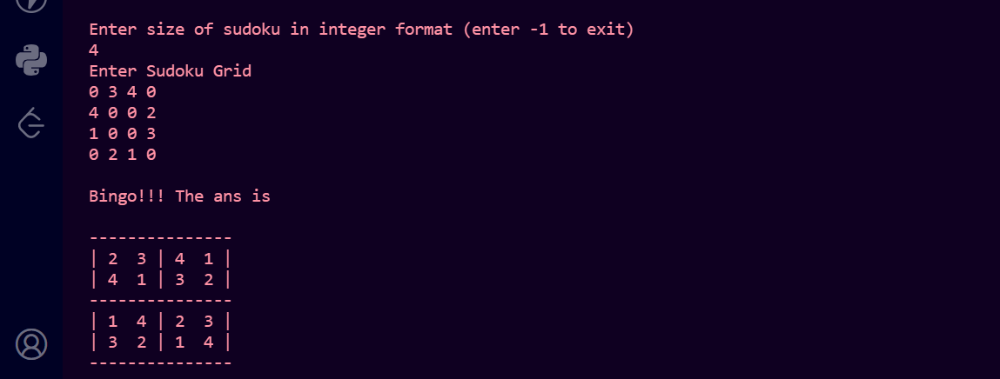
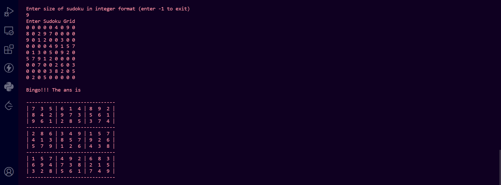
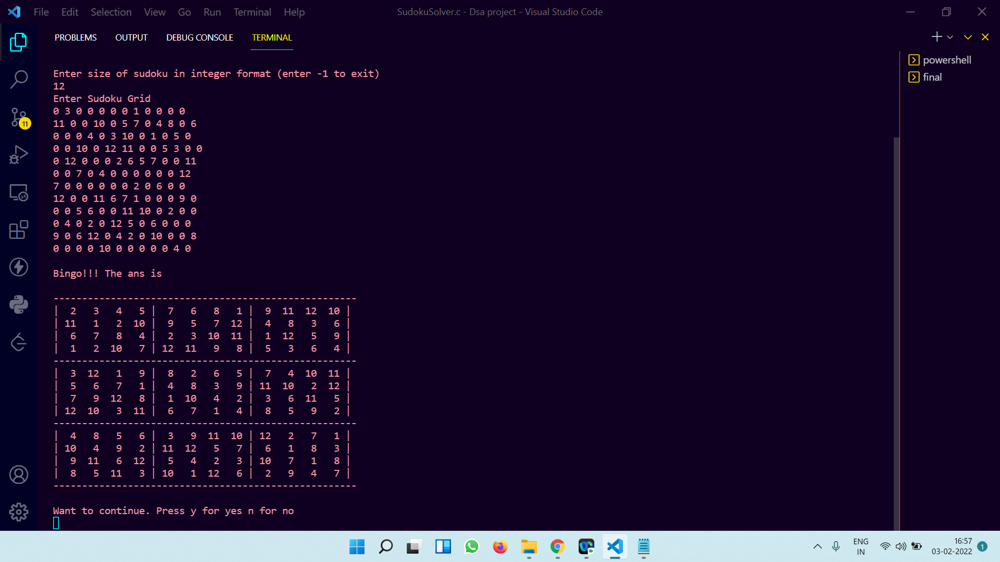

### Project Name:
# DSA-Project-SudokuSolver-using-Backtracking-Algorithm

### Hello guys, Welocome to our Sudoku-Solver Programme.

- This programme helps you to find solution for any size of Sudoku. Not limited by size of Sudoku :)
- Its time complexity is O(n^3) .
- Though it is O(n^3). Still you get solution much fast due to backtracking :)

- Key Features:
    1. User can give any size grid.
    2. Uses Backtracking Algorithm, So very Fast.
    3. Easy to read Output.
    4. Entire code written in only **C Programming Language**.
    5. Also for standard Sudoku like 9x9 ,16x16,etc (which is a perfect square) gives unique value in subgrid. :)
    
- Library Used:
  - math.h for some arithmatic application
  - stdlib.h for dynamic memory allocation for backtracking
  - stdio.h for Input Output operation
  
- How It works:
  1) First find empty location to filled.
  2) Then try all values iteratively possible for that
  3) If particular value obeys condition of grid, then call recursively for next empty cell.
  4) Goes till we don't get solution.
  5) If gets solution then return 1 and print the solution for given Sudoku.
  6) If no solution possible then return 0.
  7) If there is some error in input then return -1.

#### Working Application 

##### 4X4 Sudoku:

##### 9X9 Sudoku:

##### 12X12 Sudoku:

##### 15X15 Sudoku:

